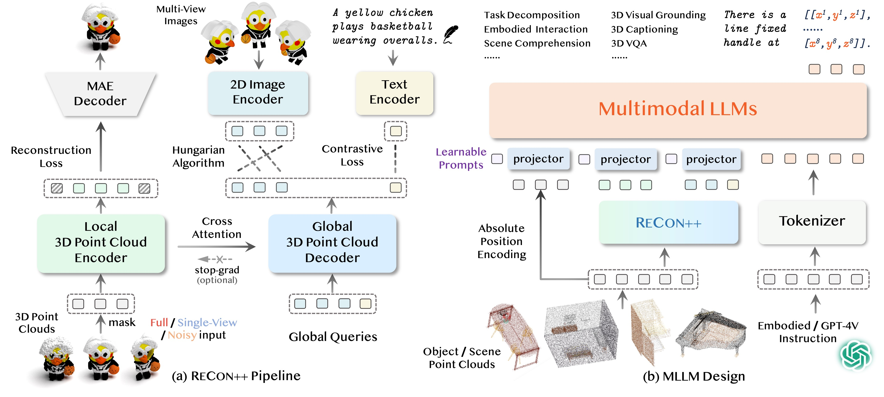

# ShapeLLM: Universal 3D Object Understanding for Embodied Interaction

*We present ShapeLLM, the first 3D Multimodal Large Language Model designed for embodied interaction, exploring a universal 3D object understanding with 3D point clouds and languages.*

[Zekun Qi](https://qizekun.github.io/), [Runpei Dong](https://runpeidong.web.illinois.edu/), [Shaochen Zhang](https://github.com/zsc000722), [Haoran Geng](https://geng-haoran.github.io/), [Chunrui Han](https://scholar.google.com/citations?user=D6tWz44AAAAJ), [Zheng Ge](https://joker316701882.github.io/), [Li Yi](https://ericyi.github.io) and [Kaisheng Ma](http://group.iiis.tsinghua.edu.cn/~maks/leader.html)

[](https://paperswithcode.com/sota/3d-question-answering-3d-qa-on-3d-mm-vet?p=shapellm-universal-3d-object-understanding)
[](https://paperswithcode.com/sota/zero-shot-transfer-3d-point-cloud-2?p=shapellm-universal-3d-object-understanding)
[](https://paperswithcode.com/sota/zero-shot-3d-classification-on-objaverse-lvis?p=shapellm-universal-3d-object-understanding)
[](https://paperswithcode.com/sota/zero-shot-transfer-3d-point-cloud?p=shapellm-universal-3d-object-understanding)
[](https://paperswithcode.com/sota/3d-point-cloud-classification-on-scanobjectnn?p=shapellm-universal-3d-object-understanding)
[](https://paperswithcode.com/sota/3d-point-cloud-classification-on-modelnet40?p=shapellm-universal-3d-object-understanding)
[](https://paperswithcode.com/sota/few-shot-3d-point-cloud-classification-on-3?p=shapellm-universal-3d-object-understanding)
[](https://paperswithcode.com/sota/3d-point-cloud-linear-classification-on?p=shapellm-universal-3d-object-understanding)

[](https://qizekun.github.io/shapellm/)
[](https://arxiv.org/abs/2402.17766)
[](https://huggingface.co/collections/qizekun/shapellm-65e978379c1260a85abe8aee)
[](https://github.com/tatsu-lab/stanford_alpaca/blob/main/LICENSE)
[](https://github.com/tatsu-lab/stanford_alpaca/blob/main/DATA_LICENSE)

<div style="text-align: center;">
    
</div>

**1.** ShapeLLM is the first 3D Multimodal Large Language Model designed for `embodied interaction`.

**2.** ShapeLLM supports `single-view colored point cloud input`, which can be effortlessly obtained from RGBD cameras.
 
**3.** We introduce a robust 3D QA benchmark, `3D MM-Vet`, encompassing various variants including single-view, noise jitter, etc.

**4.** We extend the powerful point encoder architecture, `ReCon++`, achieving state-of-the-art performance across a range of representation learning tasks.

## Contents
- [Install](#install)
- [Model Zoo](https://github.com/qizekun/ShapeLLM/blob/main/docs/MODEL_ZOO.md)
- [Dataset](https://github.com/qizekun/ShapeLLM/blob/main/docs/Data.md)
- [ShapeLLM](#ShapeLLM)
  - [Demo](#Demo)
  - [Training](#Training)
  - [3D MM-Vet](#Zero-shot-Understanding-on-3D-MM-Vet)
  - [GApartNet](#Visual-Grounding-on-GApartNet)
- [ReCon++](#ReCon++)
  - [Pretrain](#Pretrain)
  - [Classification](#Classification)
  - [Few-shot Learning](#Few-shot-Learning)
  - [Zero-shot Learning](#Zero-shot-Learning)
- [3D MM-Vet](#3D-MM-Vet)

## Install

[//]: # (If you are using Windows, do *NOT* proceed, see instructions [here]&#40;https://github.com/qizekun/LLaVA/blob/main/docs/Windows.md&#41;.)

1. Clone this repository and navigate to ShapeLLM folder
```Shell
git clone https://github.com/qizekun/ShapeLLM.git
cd ShapeLLM
```
2. Install Package
```Shell
conda create -n shapellm python=3.10 -y
conda activate shapellm
pip install --upgrade pip  # enable PEP 660 support
pip install -e .
```
3. Install additional packages for training cases
```Shell
pip install -e ".[train]"
pip install flash-attn --no-build-isolation
```
4. Install PointNet++
```Shell
pip install "git+https://github.com/erikwijmans/Pointnet2_PyTorch.git#egg=pointnet2_ops&subdirectory=pointnet2_ops_lib"
```


## ShapeLLM
### model weights
Please check out our [Model Zoo](https://github.com/qizekun/ShapeLLM/blob/main/docs/MODEL_ZOO.md) for all public ShapeLLM checkpoints.

### Demo
#### CLI Inference
Chat about point clouds using CLI interface. It also supports multiple GPUs, 4-bit and 8-bit quantized inference.
```Shell
python -m llava.serve.cli \
    --model-path qizekun/ShapeLLM_13B_general_v1.0 \
    --pts-file assets/instrument.npy
```

### Training
Consistent with LLaVA, we adopt a two-stage training approach. In the first stage, we solely fine-tune the projector for semantic alignment. In the second stage, we conduct full fine-tuning using Instruction Following data.
Download data following [DATA](https://github.com/qizekun/ShapeLLM/blob/main/docs/DATA.md), organize the data as follows in `./playground/data/shapellm/`,
```
│playground/data/shapellm/
├── cap3d_objaverse_785k.json
├── cap3d_objaverse_sft_45k.json
├── gapartnet_sft_27k_openai.json
├── gapartnet_pcs
│   ├── Box_100129_0_0.npy
│   └── ...
└── cap3d_pcs
    ├── 00000054c36d44a2a483bdbff31d8edf.pt
    └── ...
```
Furthermore, ShapeLLM utilizes the Large version of [ReCon++](https://github.com/qizekun/ShapeLLM/blob/main/ReConV2/cfgs/pretrain/large/openshape.yaml) as the point encoder.
You need to download the [ReCon++ weight](https://huggingface.co/qizekun/ReConV2/blob/main/zeroshot/large/best_lvis.pth) and save it to `./checkpoints/recon/large.pth`.
```
│checkpoints/recon/
└── large.pth
```
**1. Feature Alignment Stage**
```
sh scripts/pretrain.sh
```
**2. Visual Instruction Tuning Stage**
```
sh scripts/finetune.sh
```
The training takes around 14 hours for ShapeLLM-13B on 8x A100 (80G). It takes around 7 hours for ShapeLLM-7B.

### Zero-shot Understanding on 3D MM-Vet
Evaluate 3D MLLMs for integrated capabilities and embodied interaction capabilities, run the script:
```
sh scripts/eval/mmvet.sh
```
Using GPT-4 to calulate the 3D MM-Vet score:
```
sh scripts/eval/eval_mmvet.sh
```

### Visual Grounding on GApartNet
Evaluate the performance of ShapeLLM on the GApartNet dataset, run the script:
```
sh scripts/eval/gapartnet_ref.sh
```
Calucate the generative 3D visual grounding accuracy:
```
sh scripts/eval/eval_gapartnet.sh
```

## ReCon++
### ReCon++ model weights
Please check out our [Model Zoo](https://github.com/qizekun/ShapeLLM/blob/main/docs/MODEL_ZOO.md) for all public ReCon++ checkpoints.

### Pretrain
Download and organize data following [DATA](https://github.com/qizekun/ShapeLLM/blob/main/docs/DATA.md).
If you encounter issues accessing Huggingface, please use `export HF_ENDPOINT=https://hf-mirror.com`.

ReCon++ adopts a two-stage pre-training approach, initially conducting generative pre-training in either random or causal form, followed by cross-modal contrastive learning. It is worth noting that we employ a gradient stopping strategy for transfer learning tasks, while we do not use gradient stopping for zero-shot tasks.
```
sh ReConV2/scripts/pretrain_reconstruch.sh <exp_name>
```
```
sh ReConV2/scripts/pretrain_contrast.sh <exp_name> <path/to/stage1-pre-trained/model>
```

### Classification
| Model                                                 | Version | OBJ_BG | OBJ_ONLY | PB_T50_RS | MN-40 1k | MN-40 8k |
|-------------------------------------------------------|---------|--------|----------|-----------|----------|----------|
| [ACT](https://github.com/RunpeiDong/ACT)              | Small   | 93.29% | 91.91%   | 88.21%    | 93.7%    | 94.0%    |
| [ReCon](https://github.com/qizekun/ReCon)             | Small   | 95.35% | 93.80%   | 91.26%    | 94.5%    | 94.7%    |
| [PointGPT](https://github.com/CGuangyan-BIT/PointGPT) | Base    | 95.8%  | 95.2%    | 91.9%     | 94.4%    | 94.6%    |
| [ReCon++](https://github.com/qizekun/ShapeLLM)        | Base    | 98.62% | 96.21%   | 93.34%    | 94.6%    | 94.8%    |
| [ReCon++](https://github.com/qizekun/ShapeLLM)        | Large   | 98.80% | 97.59%   | 95.25%    | 94.8%    | 95.0%    |

Fine-tuning with the default configuration, run the script:
```
bash ReConV2/scripts/cls.sh <GPU> <exp_name> <path/to/pre-trained/model>
```
Test&Voting with the default configuration, run the script:
```
bash ReConV2/scripts/test.sh <GPU> <exp_name> <path/to/best/fine-tuned/model>
```

### Few-shot-Learning
| Model                                                 | Version | 5w10s (%)  | 5w20s (%)  | 10w10s (%) | 10w20s (%) |
|-------------------------------------------------------|---------|------------|------------|------------|------------|
| [ACT](https://github.com/RunpeiDong/ACT)              | Small   | 96.8 ± 2.3 | 98.0 ± 1.4 | 93.3 ± 4.0 | 95.6 ± 2.8 |
| [ReCon](https://github.com/qizekun/ReCon)             | Small   | 97.3 ± 1.9 | 98.9 ± 1.2 | 93.3 ± 3.9 | 95.8 ± 3.0 |
| [PointGPT](https://github.com/CGuangyan-BIT/PointGPT) | Large   | 98.0 ± 1.9 | 99.0 ± 1.0 | 94.1 ± 3.3 | 96.1 ± 2.8 |
| [ReCon++](https://github.com/qizekun/ShapeLLM)        | Large   | 98.0 ± 2.3 | 99.5 ± 0.8 | 94.5 ± 4.1 | 96.5 ± 3.0 |

Few-shot with the default configuration, run the script:
```
sh ReConV2/scripts/fewshot.sh <GPU> <exp_name> <path/to/pre-trained/model> <way> <shot> <fold>
```

### Zero-shot-Learning
| Model                                                  | Version | Objaverse-LVIS | ModelNet40 | ScanObjectNN |
|--------------------------------------------------------|---------|----------------|------------|--------------|
| [OpenShape](https://github.com/Colin97/OpenShape_code) | Base    | 46.8%          | 84.4%      | 52.2%        |
| [Uni3D](https://github.com/baaivision/Uni3D)           | Base    | 51.7%          | 86.3%      | 63.8%        |
| [Uni3D](https://github.com/baaivision/Uni3D)           | Large   | 53.1%          | 86.3%      | 58.2%        |
| [ReCon++](https://github.com/qizekun/ShapeLLM)         | Base    | 53.2%          | 86.5%      | 63.6%        |
| [ReCon++](https://github.com/qizekun/ShapeLLM)         | Large   | 53.7%          | 87.3%      | 65.4%        |

In the pre-training process, Zero-shot evaluation is enabled by default.
Zero-shot with the default configuration, run the script:
```
bash ReConV2/scripts/zeroshot.sh <GPU> <exp_name> <path/to/pre-trained/model>
```


## 3D MM-Vet

3D MM-Vet is a carefully crafted multi-level 3D QA benchmark that consists of 59 unique 3D models and 232 human-written questions and answers with rich content.

The test data and scripts have been uploaded to [Hugging Face](https://huggingface.co/datasets/qizekun/3D-MM-Vet). You can also locate the evaluation scripts from the [codebase](https://github.com/qizekun/ShapeLLM/blob/main/scripts/eval/eval_mmvet.sh) of ShapeLLM.

Furthermore, we propose 3D MM-Vet-C, which contains three variants: single-view, jitter, and rotation. They represent extracting partial point clouds of the front view field of view, adding Gaussian noise to the point cloud xyz, and random rotation on the x, y, and z axes, respectively.

Here is a more detailed explanation of each variant:

- **Single-view**: This variant focuses on the model's ability to understand the 3D object from a single viewpoint. To create the single-view variant, we extract the front-view point cloud of each model.
- **Jitter**: This variant tests the model's robustness to noise. To create the jitter variant, we add Gaussian noise with zero mean and variance of 0.01 to the point cloud xyz.
- **Rotation**: This variant examines the model's ability to understand the 3D scene from different viewpoints. To create the rotation variant, we randomly apply 30 degrees of random rotation on the x, y, and z axes.

We believe that 3D MM-Vet and 3D MM-Vet-C are valuable resources for the 3D QA community. They can be used to evaluate the performance of existing models and to develop new models that are better at understanding and reasoning about 3D objects.

## Visualization
We use [PointVisualizaiton](https://github.com/qizekun/PointVisualizaiton) repo to render beautiful point cloud images, including specified color rendering and attention distribution rendering.

## Citation

If you find ShapeLLM or ReCon++ useful for your research and applications, please cite using this BibTeX:
```bibtex
@article{qi2024shapellm,
  author = {Qi, Zekun and Dong, Runpei and Zhang, Shaochen and Geng, Haoran and Han, Chunrui and Ge, Zheng and Yi, Li and Ma, Kaisheng},
  title = {ShapeLLM: Universal 3D Object Understanding for Embodied Interaction},
  journal = {arXiv preprint arXiv:2402.17766},
  year = {2024}
}
```
and closely related work [ReCon](https://github.com/qizekun/ReCon) and [ACT](https://github.com/RunpeiDong/ACT):
```bibtex
@inproceedings{qi2023recon,
  title={Contrast with Reconstruct: Contrastive 3D Representation Learning Guided by Generative Pretraining},
  author={Qi, Zekun and Dong, Runpei and Fan, Guofan and Ge, Zheng and Zhang, Xiangyu and Ma, Kaisheng and Yi, Li},
  booktitle={International Conference on Machine Learning (ICML) },
  url={https://openreview.net/forum?id=80IfYewOh1},
  year={2023}
}

@inproceedings{dong2023act,
  title={Autoencoders as Cross-Modal Teachers: Can Pretrained 2D Image Transformers Help 3D Representation Learning?},
  author={Runpei Dong and Zekun Qi and Linfeng Zhang and Junbo Zhang and Jianjian Sun and Zheng Ge and Li Yi and Kaisheng Ma},
  booktitle={The Eleventh International Conference on Learning Representations (ICLR) },
  url={https://openreview.net/forum?id=8Oun8ZUVe8N},
  year={2023}
}
```

## Acknowledgement

This codebase is built upon [LLaVA](https://github.com/haotian-liu/LLaVA), [OpenShape](https://github.com/Colin97/OpenShape_code), [ReCon](https://github.com/qizekun/ReCon) and [PointGPT](https://github.com/CGuangyan-BIT/PointGPT).

## Related Works

- [Point-Bind & Point-LLM](https://arxiv.org/abs/2309.00615)
- [3D-LLM](https://arxiv.org/abs/2307.12981)
- [PointLLM](http://arxiv.org/abs/2308.16911)
